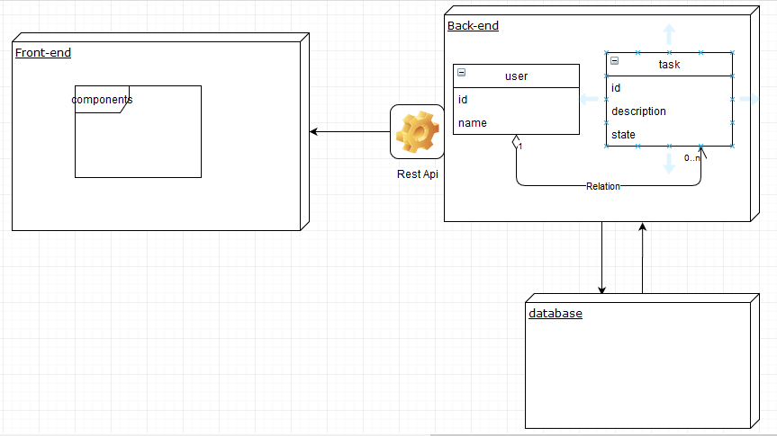

# Bunny Studio Test

Here you will find the explanation of the project and how to run in on your machine

- For the database I used MySql so if you want to test the app you need to create a MySQL database with the name: bunny_db
    - then, import the bunny_db.sql
- For the data in the database I used Faker which is a PHP library that generates fake data

- For the back-end [bunnyBack](https://github.com/yassssser/Bunny-Studio-Backend) I create a rest api with symfony using ApiPlatfome
    - to test it : 
    > - first, you need to clone or download the repository [bunnyBack](https://github.com/yassssser/Bunny-Studio-Backend)
    > - then, run on your position in the folder by running **cd bunnyBack** in your terminal
    > - finally, run **composer install** so that you will install all the dependency that you need to run your server, after the downloading finish run : **symfony server:start**
    > - leave your server starting and now let's move the to front-end

- For the Front-end [bunnyfront](https://github.com/yassssser/Bunny-Studio-Frontend) I consume the rest api using react redux and axios
    - to test it :
    > - first, you need to clone or download the repository [bunnyfront](https://github.com/yassssser/Bunny-Studio-Frontend)
    > - then, run on your position in the folder by running **cd bunnyfront** in your terminal
    > - finally, run **npm install** so that you will install all the dependency that you need to run your app, after the downloading finish run : **npm start**

